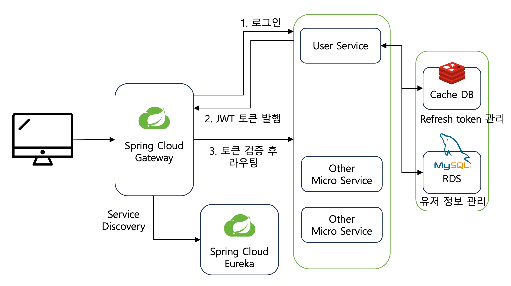
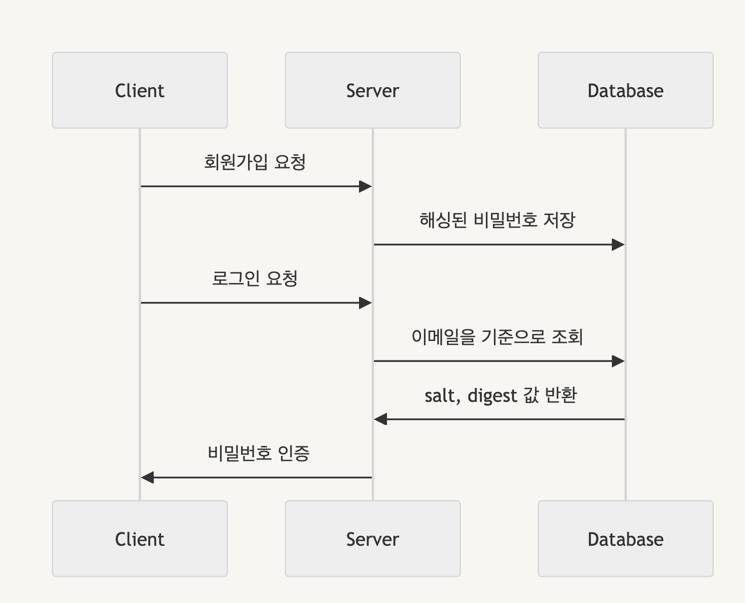
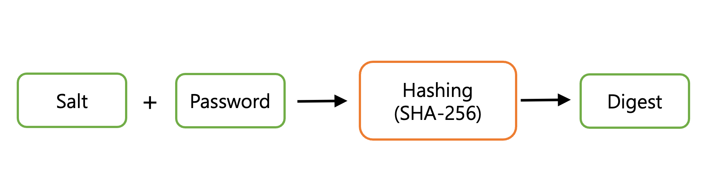

# Spring Security 없이 MSA 환경에서 JWT 기반 인증/인가 

## 개발환경

- Spring Boot 3.2.0
- Java17
- MySQL → 회원 정보 저장
    - 회원정보 데이터는 정합성이 중요하므로 RDBMS의 MySQL을 사용하였다.
- Redis → Refresh Token 저장
    - RDBMS를 사용하지 않은 이유
        - 만료시간이 지난 Refresh Token은 더미데이터가 된다. 이를 방지하기 위해서는 expires를 기준으로 CronJob을 실행해줘야 한다. `delete expires < 'now'`
    - Redis를 선택한 이유
        - TTL 설정을 통해 만료시간이 지난 Refresh Token을 자동으로 삭제할 수 있다.
        - Redis는 RDBMS 보다 서버의 cost(ex.응답시간)가 훨씬 가볍다.
- Spring Cloud
    - API Gateway에서 JWT 검증
        - Access Token을 검증하고 Micro Service로 클라이언트의 요청을 전송한다.
  
---

## 인증 플로우

1. API Gateway는 클라이언트의 회원가입과 로그인 요청을 User Service로 라우팅한다.
2. 로그인을 통해 클라이언트가 인증되면 User Service는 Access Token과 Refresh Token을 발급하고 발급된 토큰은 API Gateway를 통해 클라이언트에게 전달된다.
    1. 서버는 Refresh Token을 Redis에 저장한다.
    2. 클라이언트는 Access Token과 Refresh Token을 세션 스토리지에 저장한다.
        1. 세션스토리지에 저장하는 방식은 XSS 공격에 취약하므로 보안상 좋지 않지만, 클라이언트 단의 문제라고 생각하기 때문에 깊게 다루지 않았다.
3. 클라이언트가 API 요청을 할 때마다 API Gateway는 클라이언트의 Header에 포함된 토큰을 확인하여 검증한 후 클라이언트가 요청한 Micro Service로 라우팅한다.
4. 클라이언트의 **Access Token이 만료되면 Access Token만 재발급** 한다.
    1. Access Token이 만료 시, "Access Token 재발급" &&  "Refresh Token 재발급"하면
        1. Refresh Token을 발급한 의미가 없어지는 것이다. 예컨대, Refresh Token의 유효시간을 3일로 설정했다면 이 기간동안 유효하게 사용하도록 하기 위한 용도이다. 그런데 Access Token의 유효시간(30분)마다 재발급한다면 유효시간을 설정한 의미가 없어진다.
        2. 또한 Access Token이 한번 공격자에 의해 탈취당하면 공격자는 영구적으로 서비스에 접근할 수 있게 된다.
    2. Access Token이 만료 시, "Access Token ≠ 재발급" && "Refesh Token ≠ 재발급"이면
        1. 클라이언트가 자주 로그인을 해야한다는 불편함이 생긴다.
5. 클라이언트가 브라우저를 종료하면,
    1. 토큰을 세션 스토리지에 저장했으므로 브라우저를 종료하면 데이터가 초기화된다.
    2. 하지만 서버는 클라이언트가 브라우저를 종료했는지 알 수 없으므로 서버의 Refresh Token은 더미데이터가 된다. 이를 해결하기 위해 서버에서 Refresh Token을 redis에서 관리하였고 TTL 설정을 통해 만료시간이 지난 Refresh Token 데이터는 자동으로 삭제되도록 하였다.
6. 클라이언트가 로그아웃 시, 클라이언트와 서버에 저장되어 있는 토큰을 삭제한다.
    1. 클라이언트 단에서는 세션 스토리지에 저장된 Access Token과 Refresh Token을 삭제한다.
    2. 서버 단에서는 Refresh Token을 즉시 삭제하고, Access Token을 블랙리스트에 보내 해당 토큰을 무효화하는 작업을 진행한다. 서버가 해당 토큰을 무효화하는 과정이 없이 세션 스토리지에 저장된 토큰만 삭제하면 클라이언트가 토큰을 미리 카피한 경우 계속해서 서버에 요청을 보낼 수 있기 때문이다.

## 암호화
사용자의 비밀번호를 서버에서 암호화하는 단계가 필요하다.

1. 해싱된 비밀번호(digest)?
    1. 클라이언트로부터 받은 비밀번호를 랜덤하게 생성된 salt 값과 합친 후 SHA-256 알고리즘을 사용하여 암호화하였다.
2. 비밀번호 인증?
    1. 클라이언트가 입력한 패스워드를 DB에서 조회한 salt값과 합치고 SHA-256 알고리즘으로 암호화한다. 암호화된 결과가 조회한 digest 값과 일치하는 지 검증한다.
3. 비밀번호 변경: 클라이언트가 비밀번호를 변경하면 salt 값은 재사용하지 않고 같이 변경한다.